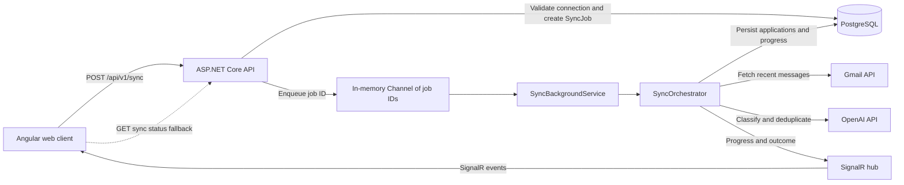
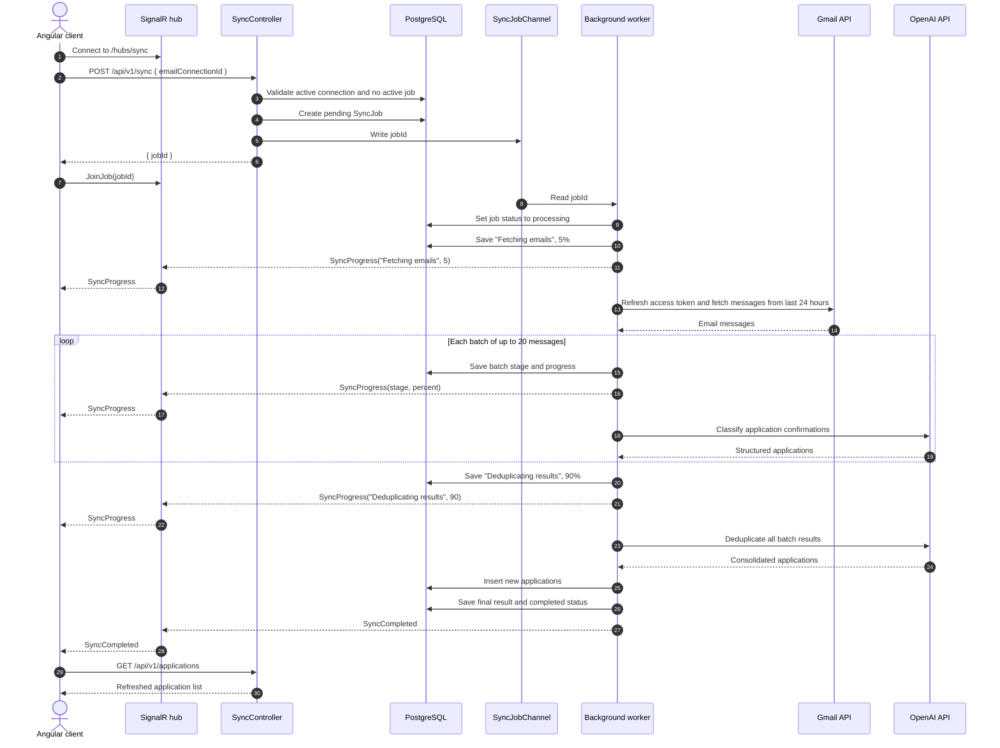

# Core Sync Architecture

This document describes the implemented core of Job Sync: converting recent email messages into persisted job application records. It intentionally excludes unrelated product features.

## Technology Stack

| Area | Technology | Role in the sync process |
| --- | --- | --- |
| Web client | Angular 21, TypeScript, RxJS | Starts a sync, joins the job's SignalR group, displays progress, and refreshes applications |
| API | .NET 10, ASP.NET Core Web API | Validates sync requests, creates jobs, exposes job status, and hosts SignalR |
| Real-time updates | ASP.NET Core SignalR | Sends progress, completion, and failure events to the client |
| Work dispatch | `System.Threading.Channels` | Passes sync job IDs from the API to the in-process worker |
| Background processing | .NET `BackgroundService` | Consumes queued jobs and runs each job in its own dependency injection scope |
| Orchestration | Application services in C# | Coordinates email retrieval, AI classification, deduplication, persistence, and progress |
| Email provider | Gmail (only for now) API with Google OAuth 2.0 | Provides read-only access to recent messages |
| Classification | OpenAI .NET SDK with structured outputs | Identifies initial application confirmations and extracts normalized fields |
| Persistence | PostgreSQL, Entity Framework Core 10, Npgsql | Stores email connections, sync jobs, and job applications |
| Testing | xUnit, ASP.NET Core `WebApplicationFactory`, NSubstitute | Covers the API integration paths around connections, sync jobs, and applications |

## System Architecture

## Core Components

### Sync API

`SyncController` accepts an `emailConnectionId`, verifies that the connection exists and is active, and rejects a request when that connection already has a pending or processing job. A valid request creates a durable `SyncJob` record and places its ID on the in-memory channel.

The status endpoint returns the job's current status, progress percentage, stage, result, and error. It also provides a fallback for clients that cannot receive SignalR events.

### Job Channel and Worker

`SyncJobChannel` is a singleton, unbounded `Channel<Guid>` used to dispatch work inside the API process.

`SyncBackgroundService` consumes job IDs and processes each job concurrently in a separate dependency injection scope. On startup, it reloads pending or processing jobs from PostgreSQL and places them back on the channel so interrupted work can run again.

### Sync Orchestrator

`SyncOrchestrator` owns the sync workflow:

1. Report that email fetching has started.
2. Retrieve Gmail messages from the previous 24 hours.
3. Split messages into batches of 20.
4. Ask OpenAI to identify initial job application confirmations and extract structured fields.
5. Run a final AI deduplication pass across all batch results.
6. Persist applications that have not already been stored for the email connection.
7. Mark progress as complete and return the final result.

### Gmail Integration

The Gmail connection uses the `gmail.readonly` OAuth scope. Job Sync stores the refresh token and mints an access token when a sync runs rather than persisting access tokens.

The current Gmail query uses `after:<unix timestamp>` for the previous 24 hours and requests up to 500 messages per page. Message headers and MIME content are converted into an internal email model before classification.

### AI Classification

`OpenAIService` sends each batch to a configured OpenAI chat model using a strict JSON schema. It extracts:

- Gmail message ID
- Company name
- Job role
- Application date
- Application status

The prompt includes only initial application confirmations. It excludes rejection notices, interview invitations, job alerts, recommendations, role closures, and later-stage status updates.

### Persistence

PostgreSQL stores three records relevant to the pipeline:

| Record | Purpose |
| --- | --- |
| `EmailConnection` | Gmail identity, refresh token, granted scopes, provider, and connection status |
| `SyncJob` | Connection-scoped execution status, progress, stage, final JSON result, and error |
| `JobApplication` | Normalized company, role, date, status, source message ID, and email connection |

Applications are deduplicated during persistence by Gmail message ID within an email connection. The final list is also stored as a JSON snapshot on the completed sync job.

## Sync Sequence

This is the core sequence moved from the original brainstorming artifact and updated to match the implemented API contract.

## Progress and Client Contract

The SignalR hub is available at `/hubs/sync`. A client subscribes to a specific job with `JoinJob(jobId)` and can unsubscribe with `LeaveJob(jobId)`.

| Event | Payload | Meaning |
| --- | --- | --- |
| `SyncProgress` | `stage`, `percent` | The current stage and persisted progress value |
| `SyncCompleted` | None | The job completed and applications can be refreshed |
| `SyncFailed` | `error` | The worker failed and persisted the error |

Clients can call `GET /api/v1/sync/status/{jobId}` when SignalR is unavailable or when they need to recover the latest persisted state.

## Concurrency, Recovery, and Failures

- Only one pending or processing sync is allowed per email connection.
- Different email connections can be processed concurrently.
- The queue is in memory, but job state is stored in PostgreSQL.
- Pending and processing jobs are re-enqueued when the worker starts.
- A revoked or invalid Gmail grant changes the connection status to `NeedsReconnect` and fails the job.
- Other unhandled worker errors mark the job as failed, persist the error message, and emit `SyncFailed`.
- Gmail and OpenAI calls do not currently have an explicit retry policy.
