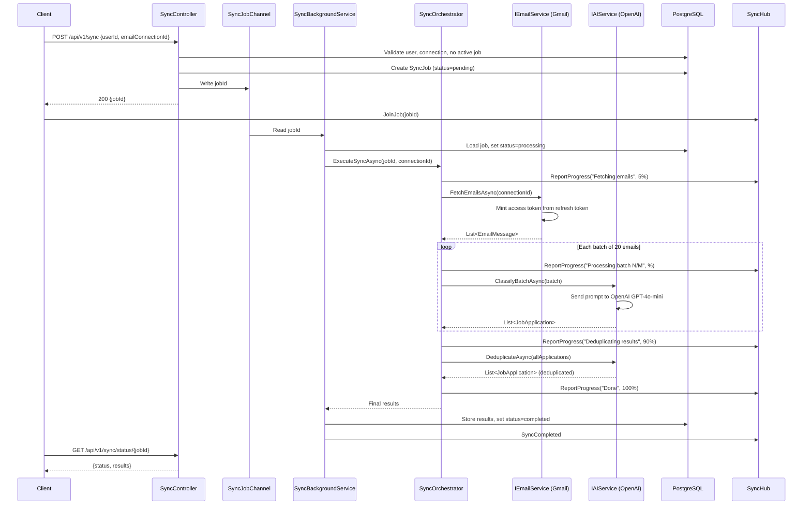

# Job Sync — Design Spec

## Overview

Job Sync tracks job applications by syncing from Gmail inboxes. A user can connect multiple Gmail accounts via OAuth, then trigger sync for a specific email connection. Sync fetches emails from the last 30 days, processes them through OpenAI GPT to identify and deduplicate job application emails, and returns structured results.

## Decisions

- No authentication — anyone can use the app, connects own Gmail
- PostgreSQL — users + email connections + sync jobs with `jsonb` for results
- Job applications returned via sync job results (not separately persisted)
- OpenAI GPT (via official OpenAI .NET SDK) for email classification and deduplication
- Batch emails to OpenAI, deduplicate within batch + final merge pass across batches
- REST API with controllers, .NET 10
- Frontend-agnostic API (React Native/Expo likely, but API works with any client)
- Async processing with SignalR real-time progress (polling as fallback)
- Email connection is upserted by `SubjectId` (same Google account = same user, no duplicate users)
- Sync request must include `emailConnectionId`
- Access token is not persisted; minted from refresh token at sync time
- On refresh token invalid/revoked/expired, mark connection `NeedsReconnect` and return reconnect-required errors

## Data Model

### Users

| Column    | Type         | Notes       |
| --------- | ------------ | ----------- |
| Id        | UUID         | PK          |
| FirstName | varchar(100) |             |
| LastName  | varchar(100) |             |
| CreatedAt | timestamp    |             |
| UpdatedAt | timestamp?   |             |
| DeletedAt | timestamp?   | soft delete |

### EmailConnections

| Column        | Type        | Notes                             |
| ------------- | ----------- | --------------------------------- |
| Id            | UUID        | PK                                |
| UserId        | UUID        | FK → Users                        |
| Email         | text        | connected mailbox email           |
| SubjectId     | text        | Google account unique id (`sub`)  |
| RefreshToken  | text        | provider token for minting access |
| GrantedScopes | text        | comma-separated OAuth scopes      |
| Status        | varchar(30) | active, needs_reconnect, revoked  |
| CreatedAt     | timestamp   |                                   |
| UpdatedAt     | timestamp?  |                                   |
| DeletedAt     | timestamp?  | soft delete                       |

### SyncJobs

| Column            | Type         | Notes                                  |
| ----------------- | ------------ | -------------------------------------- |
| Id                | UUID         | PK                                     |
| UserId            | UUID         | FK → Users                             |
| EmailConnectionId | UUID         | FK → EmailConnections                  |
| Status            | varchar(20)  | pending, processing, completed, failed |
| Progress          | int          | 0-100 percentage                       |
| Stage             | varchar(100) | current stage label                    |
| Result            | jsonb        | array of job applications              |
| Error             | text         | error message if failed                |
| CreatedAt         | timestamp    |                                        |
| UpdatedAt         | timestamp?   |                                        |
| DeletedAt         | timestamp?   | soft delete                            |

### Result JSON Shape

```json
[
  {
    "companyName": "Atlassian",
    "jobRole": "Senior Software Engineer",
    "appliedDate": "15-04-2026",
    "status": "applied"
  }
]
```

## API Endpoints

### Mail Connect

| Method | Endpoint                              | Description                                                           |
| ------ | ------------------------------------- | --------------------------------------------------------------------- |
| GET    | `/api/v1/mail-connect/gmail/start`    | Redirect user to Google OAuth consent screen                          |
| GET    | `/api/v1/mail-connect/gmail/callback` | Receive OAuth code from Google, exchange tokens, redirect to frontend |

### Sync

| Method | Endpoint                      | Description                                                                  |
| ------ | ----------------------------- | ---------------------------------------------------------------------------- |
| POST   | `/api/v1/sync`                | Start sync job (body: userId + emailConnectionId), return job ID immediately |
| GET    | `/api/v1/sync/status/{jobId}` | Poll job status + results when completed                                     |

## Architecture

### Components

- **API Layer** — REST controllers, request validation
- **Email Service (Gmail)** — mints short-lived access token from stored refresh token, fetches emails via Gmail API
- **AI Service (OpenAI)** — batches emails, sends to OpenAI GPT, parses structured response
- **Sync Orchestrator** — coordinates the pipeline (fetch → batch → process → merge → store result)
- **Progress Reporter** — persists progress to DB + delegates to ISyncHubNotifier for SignalR push
- **Hub Notifier** — sends SignalR events (SyncProgress, SyncCompleted, SyncFailed) via IHubContext
- **Sync Job Channel** — in-memory `Channel<Guid>` (singleton) connecting the API (producer) to the worker (consumer) for immediate job dispatch
- **Background Worker** — `BackgroundService` / `IHostedService`, reads from SyncJobChannel, processes each job concurrently in its own Task with its own DI scope

### Concurrency Constraints

- One active sync job per email connection — API returns 409 Conflict if that connection already has a Pending/Processing job
- No global concurrency limit — all users are served concurrently
- On startup, worker recovers orphaned Pending/Processing jobs from DB and re-queues them via the channel
- Worker runs in-process with the web API (Channel<T> is in-memory)

### Sync Pipeline Flow

1. Client calls `POST /api/v1/sync` with `userId` + `emailConnectionId`
2. Controller validates user exists, connection exists, connection belongs to user, and connection status is `active`
3. Controller checks for existing Pending/Processing job for this connection → 409 Conflict if exists
4. Controller creates SyncJob (status=pending, includes `EmailConnectionId`), writes jobId to SyncJobChannel, returns jobId
5. Background worker reads jobId from channel, spawns a new Task with its own DI scope
6. Worker loads job from DB, sets status=processing
7. Gmail Service mints short-lived access token from refresh token and fetches last 30 days of emails
8. If token mint fails with revoked/expired grant, set EmailConnection status to `needs_reconnect` and fail job with reconnect message
9. Sync Orchestrator batches emails (20 per batch)
10. Each batch → AI Service (OpenAI): identify job applications, deduplicate within batch, return structured JSON
11. After all batches complete, final merge pass → AI Service: deduplicate across all batch results
12. Store final result JSON in SyncJob, set status=completed
13. Client receives results via SignalR events or polls `GET /api/v1/sync/status/{jobId}`

### Sync Pipeline Sequence Diagram



### Recommended Client Flow

1. Client calls `POST /api/v1/sync` → gets `jobId`, processing begins immediately
2. Client connects to SignalR, calls `JoinJob(jobId)` — may miss first 1-2 progress events
3. Client calls `GET /api/v1/sync/status/{jobId}` once to catch up on current `stage`/`progress`
4. Client receives remaining `SyncProgress` events in real-time
5. On `SyncCompleted`, client calls `GET /api/v1/sync/status/{jobId}` to fetch final results

### OAuth Connect Flow

1. Frontend links user to `GET /api/v1/mail-connect/gmail/start`
2. Backend redirects (302) user to Google OAuth consent URL (scopes: `gmail.readonly openid profile email`)
3. User grants consent, Google redirects to `GET /api/v1/mail-connect/gmail/callback?code=...`
4. Backend exchanges code for tokens and reads identity claims from ID token (`sub`, `email`, `given_name`, `family_name`)
5. Backend finds existing user by `SubjectId` (returning user) or creates a new User from ID token name claims
6. Backend upserts EmailConnection by `SubjectId` and stores refresh token/scopes/status
7. Backend redirects (302) user to frontend dashboard with `userId` and `connectionId` query params
8. On error (user denied consent or missing code), backend redirects to frontend error page

### Error Flow

- Missing connection / wrong owner / inactive connection on start sync → `409` with code `CONNECTION_REQUIRES_GRANT`
- Refresh token revoked/expired/invalid grant during processing → set connection `needs_reconnect`, store error in SyncJob, set status=failed
- Client polling receives status=failed with error message

## Project Structure

```
api-web/
├── web-api/                  # REST controllers, Program.cs, DI config, SignalR hub, SyncHubNotifier
├── core/                     # Domain entities (User, EmailConnection, SyncJob), interfaces (IAIService, IEmailService, ISyncHubNotifier, ISyncJobChannel), models, enums
├── infrastructure/           # GmailService (IEmailService), OpenAIService (IAIService), token exchange, EF Core DbContext, SyncOrchestrator, SyncProgressReporter, SyncJobChannel
├── worker/                   # SyncBackgroundService (BackgroundService)
└── api-contracts/            # Request DTOs (StartSyncRequest with emailConnectionId)
```

## Tech Stack

- .NET 10, C#
- Entity Framework Core with Npgsql (PostgreSQL)
- Google.Apis.Gmail.v1 (Gmail SDK)
- OpenAI .NET SDK (official)
- `BackgroundService` for async job processing
- `Microsoft.AspNetCore.SignalR` for real-time progress

## Real-time Progress (SignalR)

### Hub

Endpoint: `/hubs/sync`

### Client → Server Methods

| Method   | Params       | Description                                  |
| -------- | ------------ | -------------------------------------------- |
| JoinJob  | jobId (Guid) | Join group `sync-{jobId}` to receive updates |
| LeaveJob | jobId (Guid) | Leave group                                  |

### Server → Client Methods

| Method        | Params                        | Description                               |
| ------------- | ----------------------------- | ----------------------------------------- |
| SyncProgress  | stage (string), percent (int) | Progress update                           |
| SyncCompleted | —                             | Job done, client fetches results via HTTP |
| SyncFailed    | error (string)                | Job failed                                |

### Progress Stages

| Stage                 | Percent              |
| --------------------- | -------------------- |
| Fetching emails       | 5%                   |
| Processing batch N/M  | Evenly split 10%–90% |
| Deduplicating results | 90%                  |
| Done                  | 100%                 |

### Flow

1. Client calls `POST /api/sync` → gets `jobId`, processing begins immediately
2. Client connects to `/hubs/sync`
3. Client invokes `JoinJob(jobId)` — may miss first 1-2 progress events
4. Client calls `GET /api/sync/status/{jobId}` once to catch up on current `stage`/`progress`
5. Backend pushes remaining `SyncProgress` events in real-time
6. Backend pushes `SyncCompleted` when done
7. Client calls `GET /api/sync/status/{jobId}` to fetch final results
8. Client invokes `LeaveJob(jobId)` or disconnects

### Fallback

Polling endpoint `GET /api/v1/sync/status/{jobId}` still works — response includes `stage` and `progress` fields for clients that can’t use SignalR.

## AI Prompt Strategy

### Per-Batch Prompt

> Given these emails, identify which are job application related. For duplicates about the same application (e.g. platform confirmation like Seek.com.au + company auto-reply), return only one entry. Return a JSON array with objects containing: companyName, jobRole, appliedDate (use the email date), status (always "applied").

### Final Merge Prompt

> Given these job application results from multiple batches, deduplicate entries for the same company+role combination. Return the final consolidated JSON array.

## Error Handling

| Scenario                               | Behavior                                               |
| -------------------------------------- | ------------------------------------------------------ |
| Connection missing/not active on start | Return 409 `CONNECTION_REQUIRES_GRANT`                 |
| Token refresh invalid/revoked/expired  | Set EmailConnection `needs_reconnect`, mark job failed |
| Gmail API error                        | Retry once, then mark failed                           |
| OpenAI API error                       | Retry batch once, then mark failed                     |
| Unhandled exception                    | Catch-all, mark job failed with message                |
